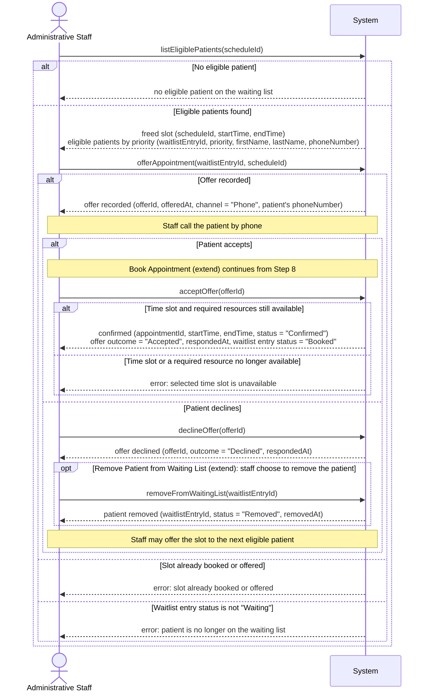

# Offer Appointment

```mermaid
sequenceDiagram
    actor Staff as Administrative Staff
    participant System

    Staff->>System: listEligiblePatients(scheduleId)
    alt No eligible patient
        System-->>Staff: no eligible patient on the waiting list
    else Eligible patients found
        System-->>Staff: freed slot (scheduleId, startTime, endTime)<br/>eligible patients by priority (waitlistEntryId, priority, firstName, lastName, phoneNumber)
        Staff->>System: offerAppointment(waitlistEntryId, scheduleId)

        alt Offer recorded
            System-->>Staff: offer recorded (offerId, offeredAt, channel = "Phone", patient's phoneNumber)
            Note over Staff,System: Staff call the patient by phone

            alt Patient accepts
                Note over Staff,System: Book Appointment (extend) continues from Step 8
                Staff->>System: acceptOffer(offerId)

                alt Time slot and required resources still available
                    System-->>Staff: confirmed (appointmentId, startTime, endTime, status = "Confirmed")<br/>offer outcome = "Accepted", respondedAt, waitlist entry status = "Booked"
                else Time slot or a required resource no longer available
                    System-->>Staff: error: selected time slot is unavailable
                end
            else Patient declines
                Staff->>System: declineOffer(offerId)
                System-->>Staff: offer declined (offerId, outcome = "Declined", respondedAt)

                opt Remove Patient from Waiting List (extend): staff choose to remove the patient
                    Staff->>System: removeFromWaitingList(waitlistEntryId)
                    System-->>Staff: patient removed (waitlistEntryId, status = "Removed", removedAt)
                end
                Note over Staff,System: Staff may offer the slot to the next eligible patient
            end
        else Slot already booked or offered
            System-->>Staff: error: slot already booked or offered
        else Waitlist entry status is not "Waiting"
            System-->>Staff: error: patient is no longer on the waiting list
        end
    end
```
