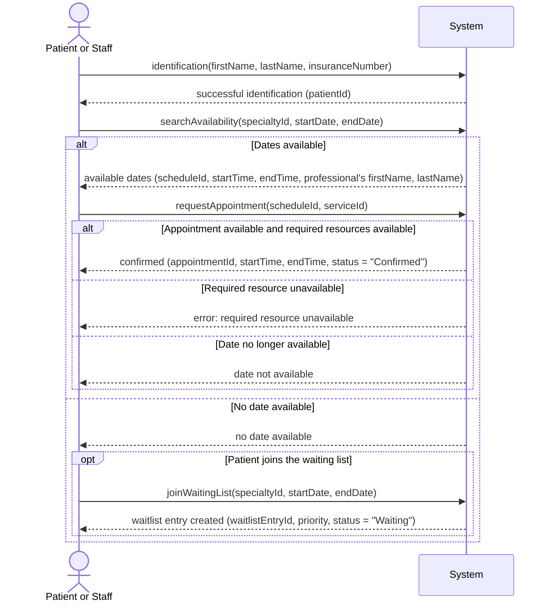

# Book Appointment

```mermaid
sequenceDiagram
    actor PatientOrStaff as Patient or Staff
    participant System

    PatientOrStaff->>System: identification(firstName, lastName, insuranceNumber)
    System-->>PatientOrStaff: successful identification (patientId)
    PatientOrStaff->>System: searchAvailability(specialtyId, startDate, endDate)

    alt Dates available
        System-->>PatientOrStaff: available dates (scheduleId, startTime, endTime, professional's firstName, lastName)
        PatientOrStaff->>System: requestAppointment(scheduleId, serviceId)

        alt Appointment available and required resources available
            System-->>PatientOrStaff: confirmed (appointmentId, startTime, endTime, status = "Confirmed")
        else Required resource unavailable
            System-->>PatientOrStaff: error: required resource unavailable
        else Date no longer available
            System-->>PatientOrStaff: date not available
        end
    else No date available
        System-->>PatientOrStaff: no date available

        opt Patient joins the waiting list
            PatientOrStaff->>System: joinWaitingList(specialtyId, startDate, endDate)
            System-->>PatientOrStaff: waitlist entry created (waitlistEntryId, priority, status = "Waiting")
        end
    end
```
