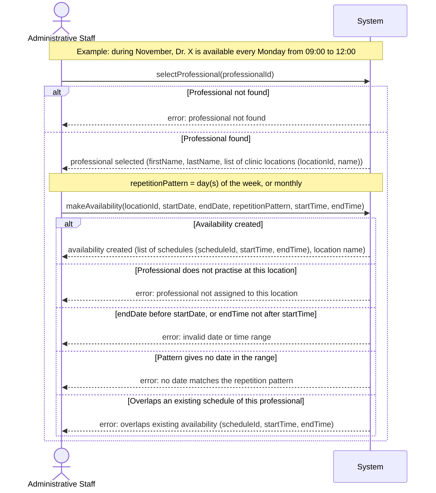

# Make Availability

```mermaid
sequenceDiagram
    actor Staff as Administrative Staff
    participant System

    Note over Staff,System: Example: during November, Dr. X is available every Monday from 09:00 to 12:00
    Staff->>System: selectProfessional(professionalId)

    alt Professional not found
        System-->>Staff: error: professional not found
    else Professional found
        System-->>Staff: professional selected (firstName, lastName, list of clinic locations (locationId, name))
        Note over Staff,System: repetitionPattern = day(s) of the week, or monthly
        Staff->>System: makeAvailability(locationId, startDate, endDate, repetitionPattern, startTime, endTime)

        alt Availability created
            System-->>Staff: availability created (list of schedules (scheduleId, startTime, endTime), location name)
        else Professional does not practise at this location
            System-->>Staff: error: professional not assigned to this location
        else endDate before startDate, or endTime not after startTime
            System-->>Staff: error: invalid date or time range
        else Pattern gives no date in the range
            System-->>Staff: error: no date matches the repetition pattern
        else Overlaps an existing schedule of this professional
            System-->>Staff: error: overlaps existing availability (scheduleId, startTime, endTime)
        end
    end
```
