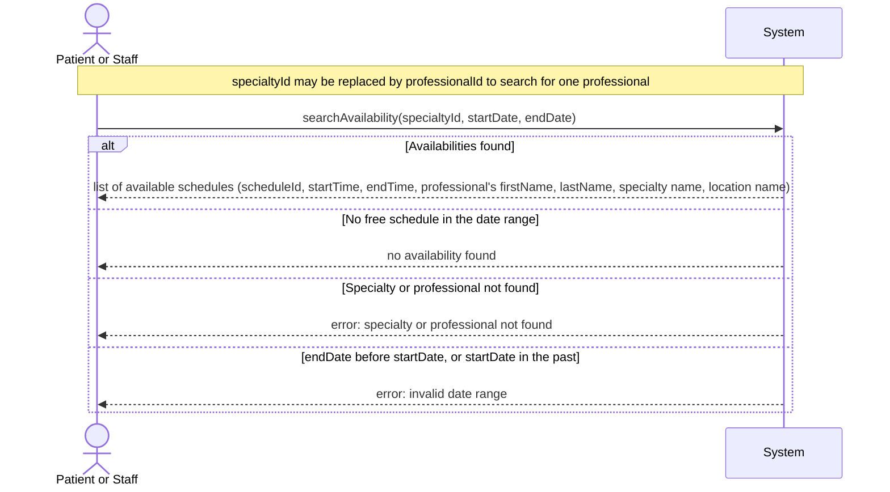

# Search Availability

```mermaid
sequenceDiagram
    actor PatientOrStaff as Patient or Staff
    participant System

    Note over PatientOrStaff,System: specialtyId may be replaced by professionalId to search for one professional
    PatientOrStaff->>System: searchAvailability(specialtyId, startDate, endDate)

    alt Availabilities found
        System-->>PatientOrStaff: list of available schedules (scheduleId, startTime, endTime, professional's firstName, lastName, specialty name, location name)
    else No free schedule in the date range
        System-->>PatientOrStaff: no availability found
    else Specialty or professional not found
        System-->>PatientOrStaff: error: specialty or professional not found
    else endDate before startDate, or startDate in the past
        System-->>PatientOrStaff: error: invalid date range
    end
```
