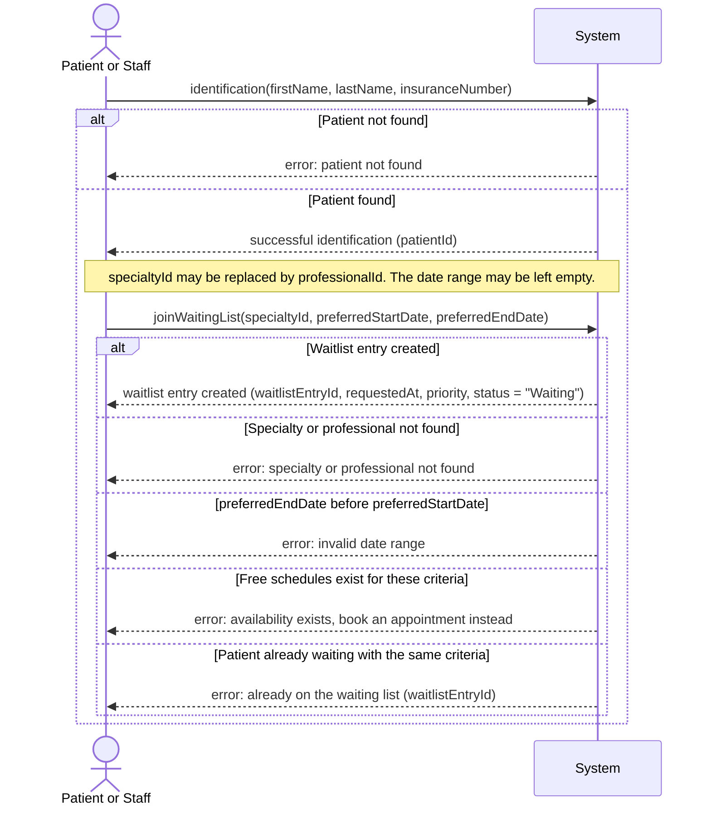

# Join Waitlist

```mermaid
sequenceDiagram
    actor PatientOrStaff as Patient or Staff
    participant System

    PatientOrStaff->>System: identification(firstName, lastName, insuranceNumber)
    alt Patient not found
        System-->>PatientOrStaff: error: patient not found
    else Patient found
        System-->>PatientOrStaff: successful identification (patientId)
        Note over PatientOrStaff,System: specialtyId may be replaced by professionalId. The date range may be left empty.
        PatientOrStaff->>System: joinWaitingList(specialtyId, preferredStartDate, preferredEndDate)

        alt Waitlist entry created
            System-->>PatientOrStaff: waitlist entry created (waitlistEntryId, requestedAt, priority, status = "Waiting")
        else Specialty or professional not found
            System-->>PatientOrStaff: error: specialty or professional not found
        else preferredEndDate before preferredStartDate
            System-->>PatientOrStaff: error: invalid date range
        else Free schedules exist for these criteria
            System-->>PatientOrStaff: error: availability exists, book an appointment instead
        else Patient already waiting with the same criteria
            System-->>PatientOrStaff: error: already on the waiting list (waitlistEntryId)
        end
    end
```
