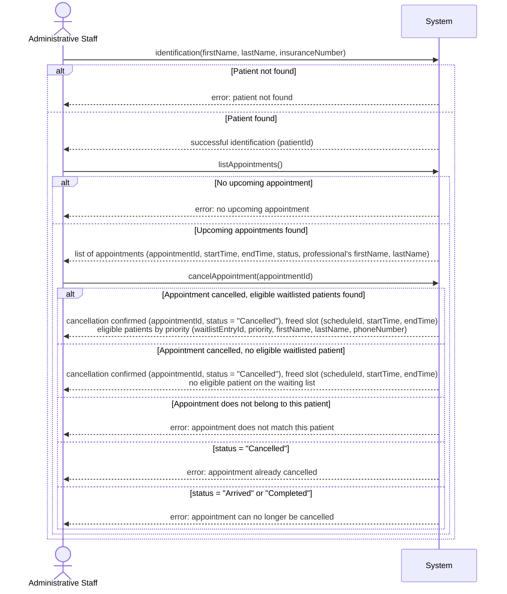

# Cancel Appointment

```mermaid
sequenceDiagram
    actor Staff as Administrative Staff
    participant System

    Staff->>System: identification(firstName, lastName, insuranceNumber)
    alt Patient not found
        System-->>Staff: error: patient not found
    else Patient found
        System-->>Staff: successful identification (patientId)
        Staff->>System: listAppointments()

        alt No upcoming appointment
            System-->>Staff: error: no upcoming appointment
        else Upcoming appointments found
            System-->>Staff: list of appointments (appointmentId, startTime, endTime, status, professional's firstName, lastName)
            Staff->>System: cancelAppointment(appointmentId)

            alt Appointment cancelled, eligible waitlisted patients found
                System-->>Staff: cancellation confirmed (appointmentId, status = "Cancelled"), freed slot (scheduleId, startTime, endTime)<br/>eligible patients by priority (waitlistEntryId, priority, firstName, lastName, phoneNumber)
            else Appointment cancelled, no eligible waitlisted patient
                System-->>Staff: cancellation confirmed (appointmentId, status = "Cancelled"), freed slot (scheduleId, startTime, endTime)<br/>no eligible patient on the waiting list
            else Appointment does not belong to this patient
                System-->>Staff: error: appointment does not match this patient
            else status = "Cancelled"
                System-->>Staff: error: appointment already cancelled
            else status = "Arrived" or "Completed"
                System-->>Staff: error: appointment can no longer be cancelled
            end
        end
    end
```
