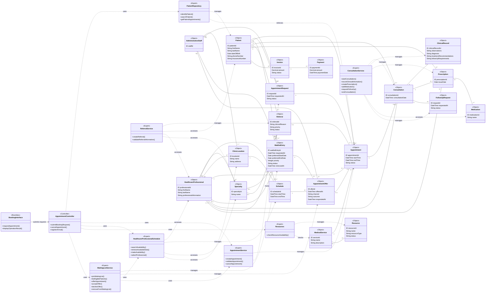

> Note Preview can be done through the Github page file OR could be read through VSCode using a UML translator and the Markdown in Preview Mode. 

```mermaid

classDiagram
direction LR

%% =========================
%% DOMAIN OBJECTS
%% =========================

class Patient {
    <<Object>>
    ID patientId
    String firstName
    String lastName
    Date dateOfBirth
    String phoneNumber
    String insuranceNumber
}

class HealthcareProfessional {
    <<Object>>
    ID professionalId
    String firstName
    String lastName
    String professionalInformation
}

class AdministrativeStaff {
    <<Object>>
    ID staffId
}

class Specialty {
    <<Object>>
    ID specialtyId
    String name
}

class Schedule {
    <<Object>>
    ID scheduleId
    DateTime startTime
    DateTime endTime
}

class ClinicLocation {
    <<Object>>
    ID locationId
    String name
    String address
}

class AppointmentRequest {
    <<Object>>
    ID requestId
    DateTime requestedAt
    String status
}

class Appointment {
    <<Object>>
    ID appointmentId
    DateTime startTime
    DateTime endTime
    String status
}

class WaitlistEntry {
    <<Object>>
    ID waitlistEntryId
    DateTime requestedAt
    Date preferredStartDate
    Date preferredEndDate
    Integer priority
    String status
    DateTime removedAt
}

class AppointmentOffer {
    <<Object>>
    ID offerId
    DateTime offeredAt
    String channel
    String outcome
    DateTime respondedAt
}

class MedicalService {
    <<Object>>
    ID serviceId
    String name
    String description
}

class Resource {
    <<Object>>
    ID resourceId
    String name
    String resourceType
    String status
}

class Consultation {
    <<Object>>
    ID consultationId
    DateTime consultationDate
}

class ClinicalRecord {
    <<Object>>
    ID clinicalRecordId
    String observations
    String diagnosis
    String treatmentRecommendations
    String followUpRequirements
}

class Referral {
    <<Object>>
    ID referralId
    String clinicalReason
    String priority
    String status
}

class Prescription {
    <<Object>>
    ID prescriptionId
    Date issueDate
}

class Medication {
    <<Object>>
    ID medicationId
    String name
}

class FollowUpRequest {
    <<Object>>
    ID requestId
    DateTime requestedAt
    String status
}

class Invoice {
    <<Object>>
    ID invoiceId
    Decimal amount
    String status
}

class Payment {
    <<Object>>
    ID paymentId
    Decimal amount
    DateTime paymentDate
}

%% =========================
%% EXPERT CLASSES
%% =========================

class BookingInterface {
    <<Boundary>>
    +requestAppointment()
    +displayOperationResult()
}

class AppointmentController {
    <<Controller>>
    +submitBookingRequest()
    +cancelAppointment()
    +registerArrival()
}

class PatientRepository {
    <<Expert>>
    +identifyPatient()
    +searchPatient()
    +getPatientAppointments()
}

class AppointmentService {
    <<Expert>>
    +createAppointment()
    +validateAppointment()
    +cancelAppointment()
}

class HealthcareProfessionalSchedule {
    <<Expert>>
    +searchAvailability()
    +retrieveAvailableSlots()
    +makeAvailability()
    +selectProfessional()
}

class Resources {
    <<Expert>>
    +checkResourceAvailability()
}

class WaitingListService {
    <<Expert>>
    +joinWaitingList()
    +listEligiblePatients()
    +offerAppointment()
    +acceptOffer()
    +declineOffer()
    +removeFromWaitingList()
}

class ConsultationService {
    <<Expert>>
    +startConsultation()
    +recordClinicalInformation()
    +createPrescription()
    +addMedication()
    +requestFollowUp()
    +endConsultation()
}

class ReferralService {
    <<Expert>>
    +createReferral()
    +validateReferralInformation()
}

%% =========================
%% DOMAIN RELATIONSHIPS
%% =========================

HealthcareProfessional "0..*" -- "0..*" Specialty
HealthcareProfessional "1" -- "0..*" Schedule
HealthcareProfessional "0..*" -- "1..*" ClinicLocation
ClinicLocation "1" -- "0..*" Schedule
AdministrativeStaff "0..*" -- "1..*" ClinicLocation

Patient "1" -- "0..*" AppointmentRequest
AdministrativeStaff "0..1" -- "0..*" AppointmentRequest
AppointmentRequest "1" -- "0..1" Appointment

Patient "1" -- "0..*" Appointment
HealthcareProfessional "1" -- "0..*" Appointment
MedicalService "1" -- "0..*" Appointment

Patient "1" -- "0..*" WaitlistEntry
HealthcareProfessional "0..1" -- "0..*" WaitlistEntry
Specialty "0..1" -- "0..*" WaitlistEntry
AdministrativeStaff "0..*" -- "0..*" WaitlistEntry
WaitlistEntry "1" -- "0..*" AppointmentOffer
Schedule "1" -- "0..*" AppointmentOffer
AdministrativeStaff "1" -- "0..*" AppointmentOffer
AppointmentOffer "0..1" -- "0..1" Appointment

MedicalService "0..*" -- "0..*" Resource

Appointment "1" -- "0..1" Consultation
HealthcareProfessional "1" -- "0..*" Consultation
Patient "1" -- "0..*" Consultation
Consultation "1" -- "0..1" ClinicalRecord

Patient "1" -- "0..*" Referral
HealthcareProfessional "1" -- "0..*" Referral
Specialty "0..1" -- "0..*" Referral
Referral "0..1" -- "0..*" Appointment

Consultation "1" -- "0..*" Prescription
HealthcareProfessional "1" -- "0..*" Prescription
Patient "1" -- "0..*" Prescription
Prescription "0..*" -- "1..*" Medication

Consultation "1" -- "0..*" FollowUpRequest

Patient "1" -- "0..*" Invoice
Invoice "1" -- "0..*" Payment

%% =========================
%% EXPERT RESPONSIBILITIES
%% =========================

BookingInterface --> AppointmentController : submits requests

AppointmentController ..> PatientRepository : uses
AppointmentController ..> AppointmentService : uses
AppointmentController ..> HealthcareProfessionalSchedule : uses
AppointmentController ..> Resources : uses
AppointmentController ..> WaitingListService : uses

PatientRepository ..> Patient : manages
PatientRepository ..> Appointment : retrieves

AppointmentService ..> Appointment : manages
AppointmentService ..> AppointmentRequest : manages

HealthcareProfessionalSchedule ..> HealthcareProfessional : accesses
HealthcareProfessionalSchedule ..> Schedule : manages
HealthcareProfessionalSchedule ..> Specialty : accesses
HealthcareProfessionalSchedule ..> ClinicLocation : accesses

Resources ..> Resource : manages
Resources ..> MedicalService : checks

WaitingListService ..> WaitlistEntry : manages
WaitingListService ..> AppointmentOffer : manages
WaitingListService ..> HealthcareProfessionalSchedule : uses
WaitingListService ..> AppointmentService : uses

ConsultationService ..> Consultation : manages
ConsultationService ..> ClinicalRecord : manages
ConsultationService ..> Prescription : manages
ConsultationService ..> Medication : accesses
ConsultationService ..> FollowUpRequest : manages

ReferralService ..> Referral : manages
ReferralService ..> Patient : accesses
ReferralService ..> HealthcareProfessional : accesses
ReferralService ..> Specialty : accesses

```