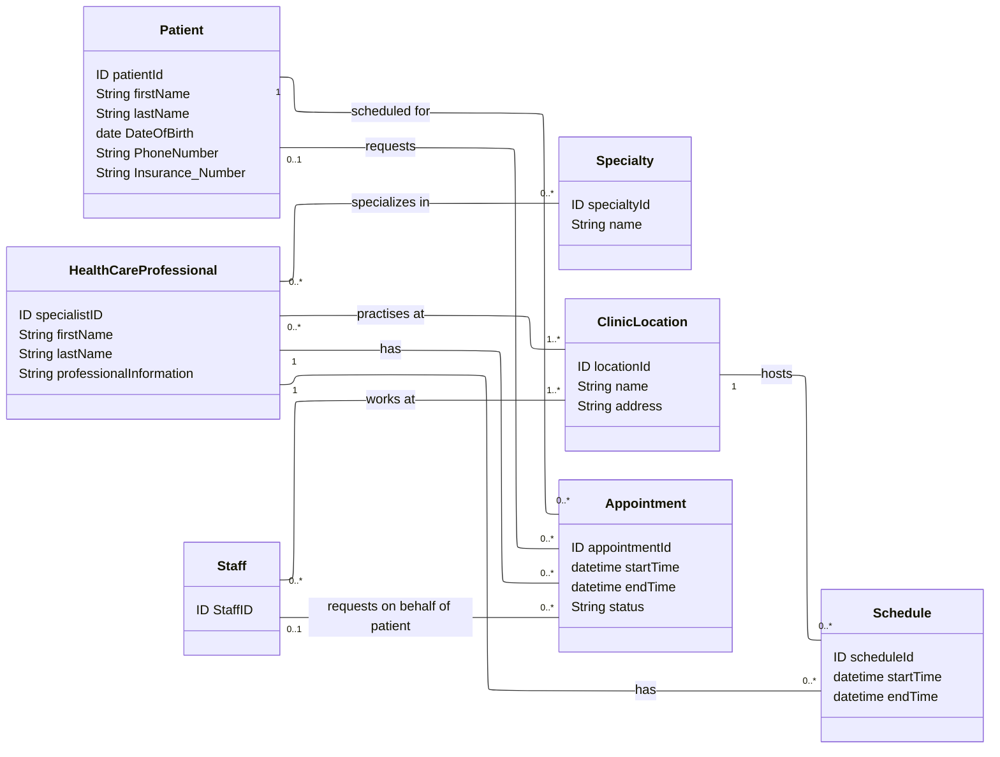

# UML Domain Model

This is the first iteration of the Domain Model.

**Version 1.0.0**

```mermaid
---
config:
  layout: elk
  class:
    hideEmptyMembersBox: false
    nodeSpacing: 90
    rankSpacing: 120
    diagramPadding: 40
    padding: 15
---

classDiagram
direction LR

    class Patient {
        ID patientId
        String firstName
        String lastName
        date DateOfBirth
        String PhoneNumber
        String Insurance_Number
    }

    class HealthCareProfessional {
        ID specialistID
        String firstName
        String lastName
        String professionalInformation
    }

    class Staff {
        ID StaffID
    }

    class Specialty {
        ID specialtyId
        String name
    }

    class Schedule {
        ID scheduleId
        datetime startTime
        datetime endTime
    }

    class ClinicLocation {
        ID locationId
        String name
        String address
    }

    class Appointment {
        ID appointmentId
        datetime startTime
        datetime endTime
        String status
    }


    HealthCareProfessional "0..*" -- "0..*" Specialty : specializes in

    HealthCareProfessional "1" -- "0..*" Schedule : has

    HealthCareProfessional "0..*" -- "1..*" ClinicLocation : practises at

    ClinicLocation "1" -- "0..*" Schedule : hosts

    Staff "0..*" -- "1..*" ClinicLocation : works at

    Patient "1" -- "0..*" Appointment : scheduled for

    Patient "0..1" -- "0..*" Appointment : requests

    Staff "0..1" -- "0..*" Appointment : requests on behalf of patient

    HealthCareProfessional "1" -- "0..*" Appointment : has
```